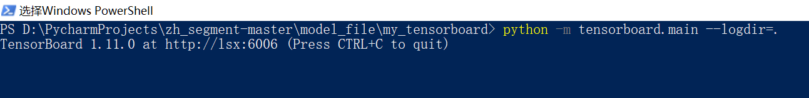
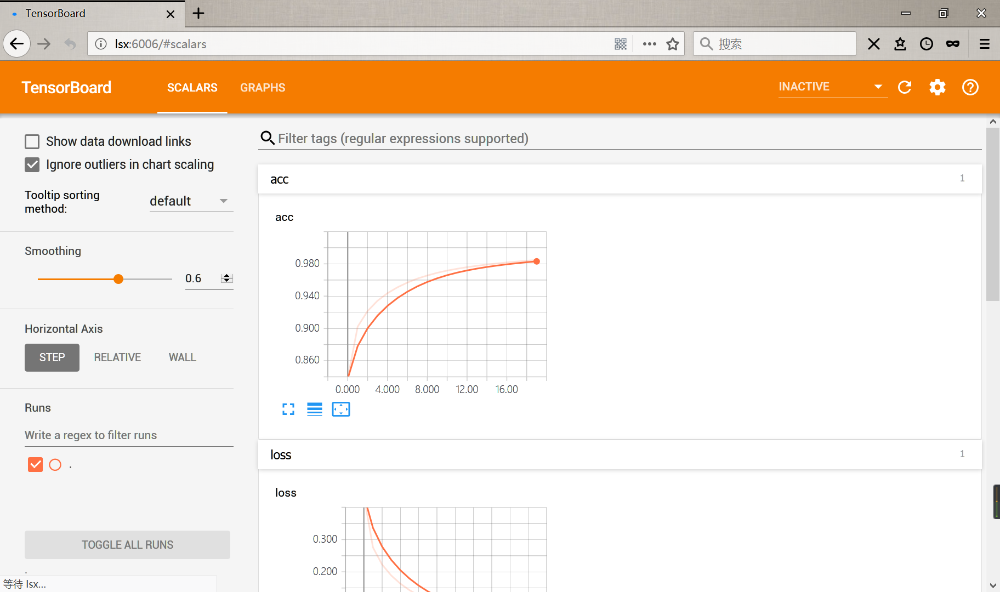

# 基于Bi-LSTM的中文分词

## 1. 文本处理

----

- 使用的是微软亚研院发布的语料库`msr_training.utf8`和北大的语料库`pku_training.utf8`，微软的语料库在行首或者行尾会出现莫名的引号，需要专门处理。

- 建立了`TrainDataProcess`类用于处理数据，调用`TrainDataProcess().createTrainData()`可将原始数据转换成可用于训练的序列数据`seq`和`label`并保存在目录`./training/`下。

- 首先将原始数据读入，清除不成对出现的引号，之后将数据按标点符号划分开，得到单个的句子，对每一个单独的句子按空格划分，获得单个的词，对单独的词进行字标注，得到标注序列。文本序列和字标注序列归一化处理，得到如下格式的内容：

    > ['人 们 常 说 生 活 是 一 部 教 科 书', '而 血 与 火 的 战 争 更 是 不 可 多 得 的 教 科 书', '她 确 实 是 名 副 其 实 的', '我 的 大 学', '心 静 渐 知 春 似 海', '花 深 每 觉 影 生 香'] 
    >
    > ['B E S S B E S S S B M E', 'S S S S S B E S S B M M E S B M E', 'S B E S B M M E S', 'S S B E', 'S S S S S S S', 'S S S S S S S']

- 因为`keras`的`RNN`只接受固定长度的输入，所以对原本的序列数据进行填充，并将文本序列转换为数字序列（使用`Tokenizer` 建立字典），字标注序列转换成`array`序列，用于训练。最后将相关数据保存成本地文件，用于建立模型及训练

## 2. 训练数据

----

1. 建立模型。使用的是`keras Sequential`顺序模型。顺序模型是多个网络层的线性堆叠，可使用`model = Sequential()`直接建立，详细说明可查看[官方文档](https://keras.io/zh/getting-started/sequential-model-guide/)。下面是本实验使用的相关参数及说明。

        self.model = Sequential([
            Embedding(VOCAB_SIZE + 1, EMBEDDING_OUT_DIM, mask_zero=True),
            Bidirectional(GRU(HIDDEN_UNITS // 2, return_sequences=True)),
            TimeDistributed(Dense(NUM_CLASS, activation='softmax'))
        ])

    - `Embedding(VOCAB_SIZE + 1, EMBEDDING_OUT_DIM, mask_zero=True)`：嵌入层，模型中的第一层，将正整数（索引值）转换为固定尺寸的稠密向量，第一个参数为`input_dim`，表示词汇表的大小，即最大整数index+1；第二个参数`output_dim`表示词向量的维度，`mask_zero = True`表示将'0'看做一个应该被屏蔽的特殊的“padding”值，这在可变长从循环神经网络层中十分有用。

    - `Bidirectional(GRU(HIDDEN_UNITS // 2, return_sequences=True))`：RNN 的双向封装器，对序列进行前向和后向计算。参数`layer`为一个`Recurrent`实例；`GRU为门限循环单元网络（Gated Recurrent Unit），第一个参数`units`为输出空间的维度，`return_sequences=True`表示返回整个序列。

    - `TimeDistributed(Dense(NUM_CLASS, activation='softmax'))`：参数为一个网络层实例，`Dense`是一个常用的全连接层，`NUM_CLASS`表示输出的维度，`activation`表示激活函数为'softmax'。

2. 模型编译。在训练模型之前，使用模型的`compile()`方法配置学习过程。`compile()`方法接受三个参数：

        self.model.compile(optimizer=Adam(),loss='categorical_crossentropy',metrics=['accuracy'])

    - `optimizer=Adam()`：optimizer是优化器，可使用现有的字符串标识符指定，也可使用指定的optimizer类的对象，此处使用的是亚当优化器，具体参考[这里](https://keras.io/optimizers/)。

    - `loss='categorical_crossentropy'`：loss为损失函数，是模型试图最小化的目标函数，可使用现有的字符串标识符指定，也可使用指定的目标函数。`'categorical_crossentropy'`表示多类的对数损失，[详细内容](https://keras-cn.readthedocs.io/en/latest/other/objectives/)。

    - `metrics=['accuracy']`表示评估标准指标。评估标准可以是现有的标准的字符串标识符，也可以是自定义的评估标准函数。`metrics=['accuracy']`适用于分类问题。

3. 训练模型。keras的模型在输入数据和标签的numpy矩阵上运行，使用model的`fit()`方法训练，[官方文档](https://keras.io/models/sequential/)。

        def doTrain(self):
            seq = np.load(SEQ_PATH)
            label = np.load(LABEL_PATH)
            checkpoint = ModelCheckpoint(
                CHECKPOINT_PATH,
                monitor='val_acc',
                verbose=1,
                save_best_only=True,
                mode='max',
                period=1
            )
            tensorboard = TensorBoard(log_dir=TENSORBOARD_PATH)

            callbacklist = [checkpoint, tensorboard]
            self.model.fit(
                seq, label,
                batch_size=128,
                epochs=20,
                validation_split=0.2,
                callbacks=callbacklist
            )

    - `fit()`的前两个参数表示输入的数据和标签，此处为之前处理好的`seq`和`label`。

    - `batch_size = 128`表示以128个样本为一个batch进行训练，`epochs`表示训练的周期数，`callbacks`是回调函数，用于查看训练的内在结果和统计，其中`checkpoint`是模型检查点，每次保存最好结果.

    - `tensorboard`是由Tensorflow提供的一个动态可视化工具，为训练编写日志。查看方法为`tensorboard --logdir=path`或`python -m tensorboard.main -m logdir=path`，如下图

        
        效果：

        

    > 最终训练结果:
    >  
    > 309598/309598 [==============================] - 641s 2ms/step - loss: 0.0454 - acc: 0.9848 - val_loss: 0.2213 - val_acc: 0.9482
    >
    > Epoch 00020: val_acc did not improve from 0.94871

## 3. 分词

----

- 首先载入之前训练好的模型和文本标记数据（字典），设置转移概率，本处直接设置转移概率，原本使用的是一组从HMM分词中扒下来的转移矩阵数据，效果不是很好，改成了等概率。

        # 载入模型
        self.model = Sequential([
            Embedding(VOCAB_SIZE + 1, EMBEDDING_OUT_DIM, mask_zero=True),
            Bidirectional(GRU(HIDDEN_UNITS // 2, return_sequences=True)),
            TimeDistributed(Dense(NUM_CLASS, activation='softmax'))
        ])

        self.model.compile(optimizer=Adam(), loss='categorical_crossentropy', metrics=['accuracy'])
        self.model.load_weights(CHECKPOINT_PATH)

        self.tokenizer = pickle.load(open(TOKENIZER_PATH,'rb'))
        # 转移概率
        # self.trans = {'SS': 0.46460125869921165,
        #     'SB': 0.3503213832274479,
        #     'BM': 0.1167175117318146,
        #     'BE': 0.8832824882681853,
        #     'MM': 0.2777743117140081,
        #     'ME': 0.7222256882859919,
        #     'ES': 0.5310673430644739,
        #     'EB': 0.46893265693552616
        # }
        self.trans = {'SS': 0.5, 'SB': 0.5, 'BM': 0.5, 'BE': 0.5, 'MM': 0.5, 'ME': 0.5, 'ES': 0.5, 'EB': 0.5}
        self.trans = {i: np.log(self.trans[i]) for i in self.trans.keys()}

- 之后将输入的句子按照标点符号、字母和数字划分，得到若干短句，在使用模型预测前，需要先将文本串转换成序列串，使用`words = self.tokenizer.texts_to_sequences([list(one_sent),])`可以获取one_sent中的所有字对应的序列，之后再将每个序列串用模型进行预测，可以得到每个字的预测向量（五元组，0代表特殊符号，1-4对应'SBME'）

    > 注：在将文本转换成整数序列时，未登录词会被跳过，所以可能出现预测结果小于原文本长度的情况，需要在分割时特殊处理，这里将所有未登录词都作为单字预测。

- 获取到预测矩阵后，使用维特比算法计算转移概率，得到最终结果。

>分词效果：
>
>['测试', '未', '登录', '词', '：', '黎盛', '烜']
>
>['一个', '人', '总是', '有', '极限', '的', '，', '所以', '，', 'j', 'o', 'j', 'o', '我', '不', '做人', '了']
>
>['你们', '呀', '，', '不要', '听', '风', '就', '是', '雨']
>
>['我', '算是', '见', '多', '识', '广', '了', '，', '西方', '哪个', '国家', '我', '没', '去', '过']
>
>['我', '乔鲁诺', '·', '乔巴', '拿', '有', '一个', '自', '认为', '是', '正确', '的', '梦想', '，', '那', '就', '是', '成为', '秧歌', 's', 't', 'a', 'r']
>
>['南京', '市长', '在', '南京市长江大桥', '发表', '讲话']
